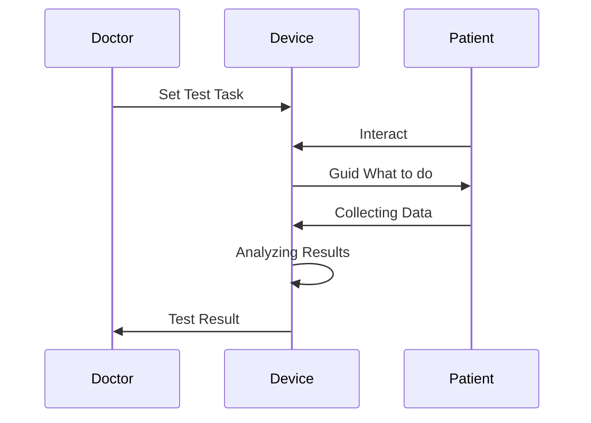

# Medic Eye

## Artificial intelligence powered medical aid device for ophthalmology

### Base Architecture

### Sequence Diagram

```mermaid
sequenceDiagram
    participant Doctor
    participant Device
    participant Patient
    Doctor ->> Device: Set Test Task
    Patient ->> Device: Interact
    Device ->> Patient: Guid What to do
    Patient ->> Device: Collecting Data
    Device ->> Device: Analyzing Results
    Device ->> Doctor: Test Result
```